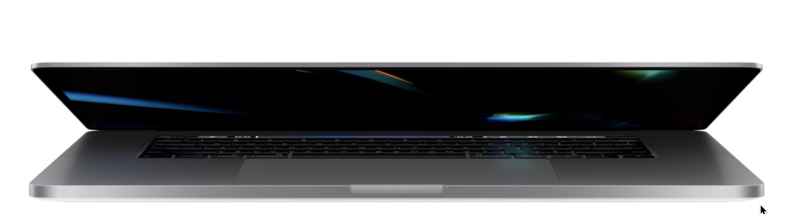

<!DOCTYPE html>
<html lang="en">
<head>
    <meta charset="UTF-8">
    <meta name="viewport" content="width=`, initial-scale=1.0">
    <meta http-equiv="X-UA-Compatible" content="ie=edge">
    <title>MacBook Pro 16-inch - Apple</title>
    <link rel="stylesheet" href="./main.css">
    
    
    
    
    
    <link rel="stylesheet" href="https://stackpath.bootstrapcdn.com/font-awesome/4.7.0/css/font-awesome.min.css">
</head>
<body>
    <ul class="global-nav">
        <li><a><i class="fa fa-apple"></i></a></li>
        <li><a>Mac</a></li>
        <li><a>iPad</a></li>
        <li><a>iPhone</a></li>
        <li><a>Watch</a></li>
        <li><a>TV</a></li>
        <li><a>Music</a></li>
        <li><a>Support</a></li>
        <li><a><i class="fa fa-search"></i></a></li>
        <li><a><i class="fa fa-shopping-bag"></i></a></li>
    </ul>
    <ul class="local-nav">
        

            

                <li><a><strong>MacBook Pro</strong></a></li>
                <li><a>16-inch model</a></li>
            

            

                <li style="color: #888">Overview</li>
                <li>Tech Specs</li>
                <li style="
                    background-color: #0071e3;
                    color: white;
                    padding: 3px 7px;
                    border-radius: 20px;
                    font-weight: 300;
                ">Buy</li>
            

        

    </ul>

    <section class="hero">
        

            <h4 class="hero-subtitle">MacBook Pro</h4>
            <h2 class="hero-title">The best for  the brightest</h2>
        

        

            
            
        

    </section>
    

    

    <section class="specs">
        

            

                

                    <h3 class="spec-title"><strong>16-inch Retina display</strong> for an immersive viewing experience.</h3>
                

                

                    <h3 class="spec-title"><strong>Up to 8TB SSD storage</strong> -- the highest capacity in any notebook</h3>
                

                

                    <h3 class="spec-title"><strong>AMD Radeon Pro 5000M series graphics</strong>  for fast rendering and seamless playback.</h3>
                

            

            

                

                    <h3 class="spec-title"><strong>Up to 8-core processor</strong>  to power through intensive workloads.</h3>
                

                

                    <h3 class="spec-title"><strong>Up to 64GB of memory</strong>  for editing large files and smooth multitasking</h3>
                

                

                    <h3 class="spec-title"><strong>Six-speaker sound system and studio-quality mics</strong>  for dramatic sound and superclean recordings.</h3>
                

            

        

            
            
    </section>
</body>
</html>